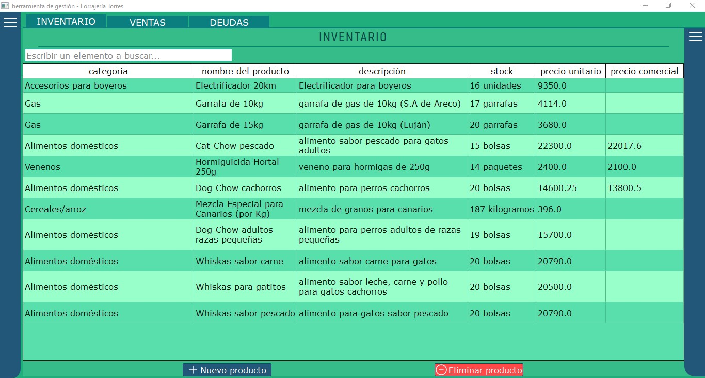
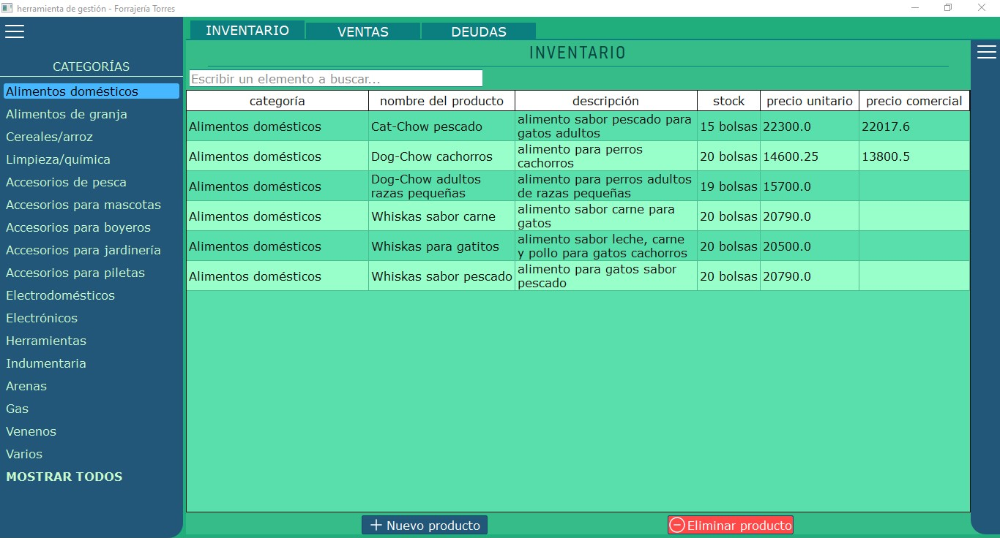
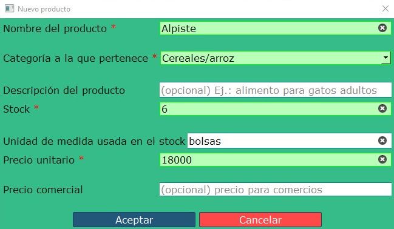
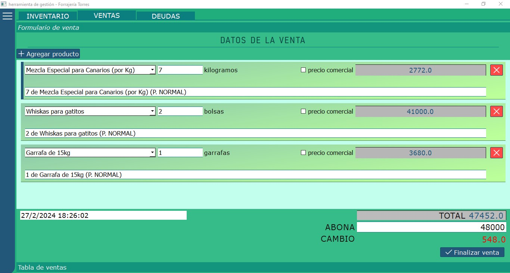
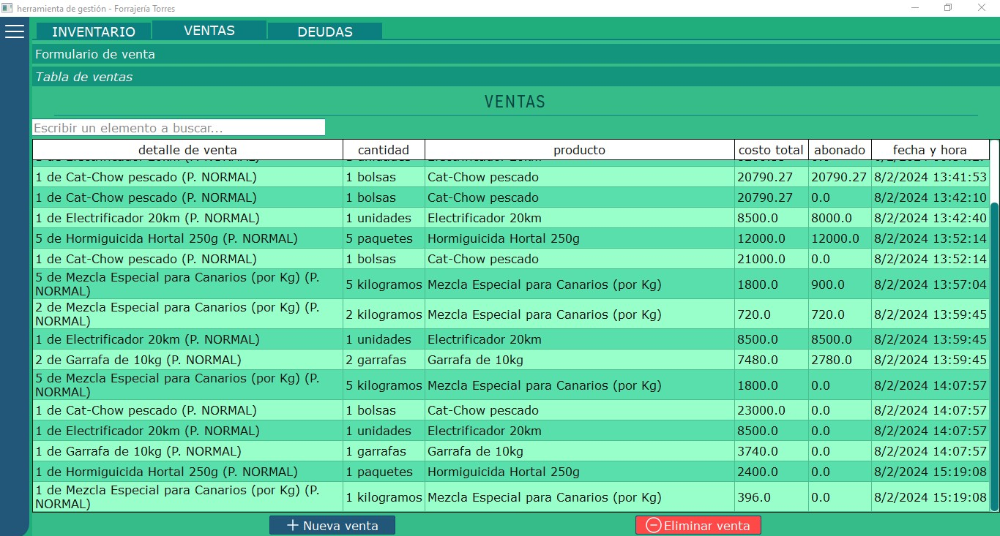

# Programa de gestión "Forrajería Torres"
El propósito de este proyecto es desarrollar un **programa de escritorio** adaptado a su ejecución en **Windows 10** para un **forraje local** y que permite al usuario realizar un *CRUD* a una base de datos que contiene los siguientes datos:

  - nombre, stock, categoría y precio de productos disponibles para su venta.
  - detalles sobre las ventas que se hacen durante las horas de atención.
  - detalles sobre las cuentas corrientes de los clientes, incluyendo algunos datos personales -no sensibles-.

El principal objetivo del programa es serle útil al usuario -obviamente💢- y al mismo tiempo que sea sencillo en su uso, intuitivo y no agobiante.

## TABLA DE CONTENIDOS
  - [INSTALACIÓN](#INSTALACIÓN)
  - [USO](#USO)
    - [INVENTARIO](#INVENTARIO)
    - [VENTAS](#VENTAS)
  - [INFORMACIÓN DEL DESARROLLO](#INFORMACIÓN-DEL-DESARROLLO)
  - [FUNCIONES A FUTURO](#FUNCIONES-A-FUTURO)
  - [LICENCIA](#LICENCIA)

 

 

### <ins>INSTALACIÓN</ins>

 

### <ins>USO</ins>
El software se divide en 3 partes principales:
  #### <ins>**INVENTARIO**</ins>  
  La sección de **INVENTARIO** sirve para mostrar los productos disponibles junto con algunos datos de interés como se muestra en la imagen siguiente.
    
   
    - <ins>**MUESTRA DE DATOS**:</ins>  
      Se pueden mostrar los datos principalmente de 2 formas:  
       1. usando la barra de búsqueda que hay encima de la tabla de inventario.  
       2. desde el menú desplegable, al cual se puede acceder haciendo *click* sobre las 3 líneas de la parte superior izquierda.
          
          El menú desplegable permite mostrar productos que pertenezcan a una ***categoría determinada***, o directamente ***mostrarlos todos***.  
           
    - <ins>**ELIMINACIÓN DE DATOS**:</ins>  
      Para eliminar datos simplemente se deben ***seleccionar los productos que se quieren borrar*** y luego hacer *click* en el botón rojo *"Eliminar producto"*.  
       
    - <ins>**AGREGADO DE DATOS**:</ins>  
      Por el contrario, para agregar productos nuevos es necesario presionar el botón azul *"Nuevo producto"*, lo que hará que se muestre un diálogo que pida varios datos
      sobre el nuevo producto. Para finalizar, simplemente presionar *"Aceptar"*.  
        
       
    - <ins>**MODIFICACIÓN DE DATOS**:</ins>  
      Para modificar datos sobre algún producto sólo hace falta hacer *doble click* sobre la celda donde esté el dato que se quiere cambiar e ingresar el nuevo valor.  
      Además, se incluye en la sección de **INVENTARIO** un menú desplegable que permite seleccionar uno o más productos e incrementar/decrementar su precio (normal o comercial) a partir de un cierto porcentaje(%) sin necesidad de calcularlos individualmente y de forma manual.
   
  
  #### <ins>**VENTAS**</ins>  
  La sección de **VENTAS** será posiblemente la más utilizada, por lo que, ¡DEBE VERSE GENIAL!✨✨  
  Esta parte se divide en 2: una parte contiene un *formulario de venta*, que consiste en una lista a la cual (dinámicamente) se le agregan los productos (que existan en INVENTARIO) que se van a vender por cliente; la otra parte es una tabla que contiene información sobre las ventas ya realizadas.
   
  Ejemplo de una venta usando el *formulario de venta*:  
    
  Se pueden agregar nuevos productos a la lista presionando el botón *"Agregar producto"* y luego rellenando los datos necesarios. El subtotal de cada producto se muestra a la derecha del nombre y cantidad de cada producto, y en la parte inferior derecha de la pantalla se muestra el total de la venta. Se debe además ingresar la cantidad abonada por el cliente y, de ser necesario, se muestra el cambio que se le debe entregar. Para finalizar la venta (y que se guarde en la base de datos) simplemente hacer *click* sobre el botón *"Finalizar venta"*.
   
  Tabla de ventas:  
  
  Lo ideal es que el usuario utilice la sección del *formulario de venta* para concretar ventas a medida que se hacen, pero no es obligatorio, también se pueden realizar usando la tabla.
  
   
  
  #### <ins>**CUENTAS CORRIENTES**</ins> (aún no en funcionamiento)

 

### <ins>INFORMACIÓN DEL DESARROLLO</ins>
El programa está desarrollado en ***Python*** en su versión 3.11, usando el framework para desarrollo de *GUIs* ***PySide6***.
El manejo de bases de datos es llevado a cabo con ***SQLite*** para lograr una mayor rapidez en la ejecución de las consultas.

 

### <ins>FUNCIONES A FUTURO</ins>
- [ ] Las tablas aún no se pueden ordenar, por lo que antes de avanzar con las funciones de abajo pienso realizar esta.
- [ ] Implementación de un **sistema de estadísticas** con respecto a los productos más vendidos -y menos vendidos- usando gráficos de barras (por ser valores discretos).
- [ ] Implementación de un **sistema de facturación** que permita crear facturas y distribuirlas a los clientes. **(a considerar)**
- [ ] Implementación de un sistema de pedidos a proveedores y registro de pedidos. **(a considerar)**

 

### <ins>LICENCIA</ins>
Software bajo licencia Apache v2.0.
URL oficial: [https://www.apache.org/licenses/LICENSE-2.0]
