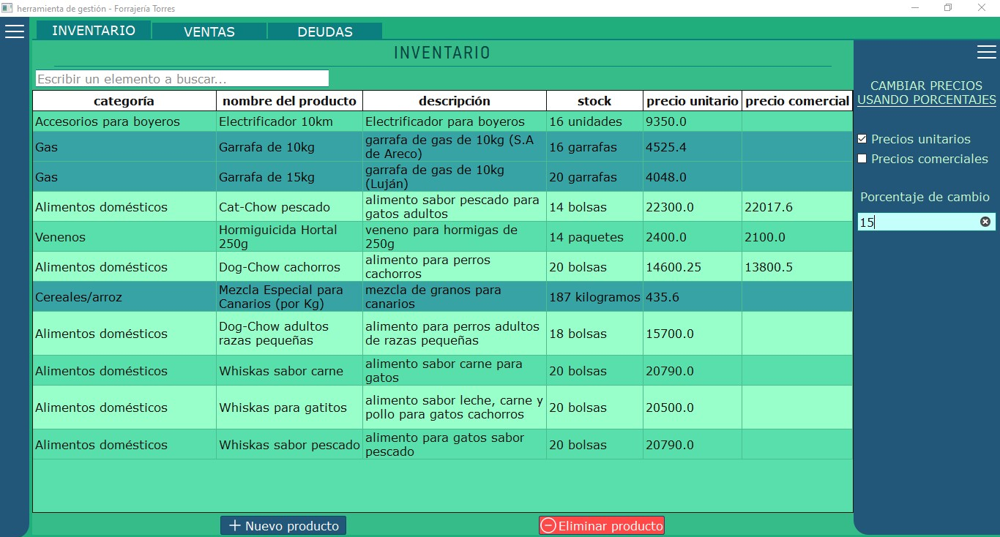
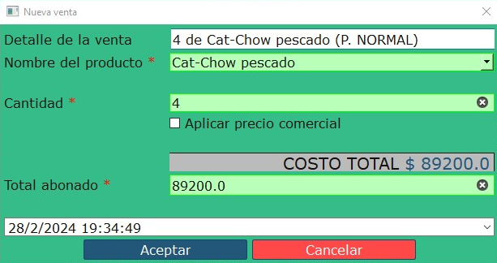
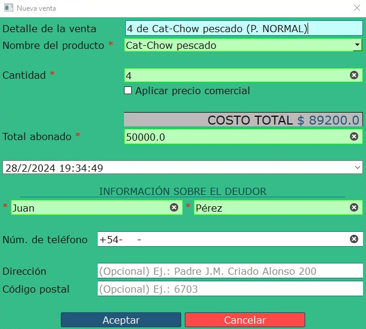

# Programa de gestión "Forrajería Torres"
El propósito de este proyecto es desarrollar un **programa de escritorio** adaptado a su ejecución en **Windows 10** o superior para un **forraje local** y que permite al usuario realizar un *CRUD* a una base de datos que contiene la siguiente información:

  - detalles de inventario (productos disponibles, stock, precios, etc.)
  - detalles de ventas realizadas.
  - detalles de cuentas corrientes de los clientes.

Éste programa de gestión fue diseñado teniendo en cuenta las necesidades específicas del usuario, además de que busca ser simple, eficiente y sencillo de usar, dado que "la simplicidad es la máxima sofisticación" (frase de Leonardo Da Vinci).

## TABLA DE CONTENIDOS
  - [INSTALACIÓN](#INSTALACIÓN)
  - [USO](#USO)
    - [INVENTARIO](#INVENTARIO)
    - [VENTAS](#VENTAS)
  - [INFORMACIÓN DEL DESARROLLO](#INFORMACIÓN-DEL-DESARROLLO)
  - [FUNCIONES A FUTURO](#FUNCIONES-A-FUTURO)
  - [LICENCIA](#LICENCIA)

 

 

### <ins>INSTALACIÓN</ins>
(a implementar)

 

### <ins>USO</ins>
El software se divide en 3 partes principales:
  #### <ins>**INVENTARIO**</ins>  
  La sección de **INVENTARIO** sirve para mostrar los productos disponibles junto con algunos datos de interés como se muestra en la imagen siguiente.
    
    - **<ins>MUESTRA DE DATOS</ins>**:  
      Se pueden mostrar los datos principalmente de 2 formas:  
        1. usando la barra de búsqueda que hay encima de la tabla de inventario.  
        2. desde el menú desplegable, al cual se puede acceder haciendo *click* sobre las 3 líneas de la parte superior izquierda.
          
          El menú desplegable permite mostrar productos que pertenezcan a una ***categoría determinada***, o directamente ***mostrarlos todos***.  
           
    - <ins>**ELIMINACIÓN DE DATOS**:</ins>  
      Para eliminar datos simplemente se deben ***seleccionar los productos que se quieren borrar*** y luego hacer *click* en el botón rojo *"Eliminar producto"*.  
       
    - <ins>**AGREGADO DE DATOS**:</ins>  
      Por el contrario, para agregar productos nuevos es necesario presionar el botón azul *"Nuevo producto"*, lo que hará que se muestre un diálogo que pida varios datos
      sobre el nuevo producto. Para finalizar, simplemente presionar *"Aceptar"*.  
        
       
    - <ins>**MODIFICACIÓN DE DATOS**:</ins>  
      Para modificar datos sobre algún producto sólo hace falta hacer *doble click* sobre la celda donde esté el dato que se quiere cambiar e ingresar el nuevo valor.  
      Además, se incluye en la sección de **INVENTARIO** un menú desplegable que permite seleccionar uno o más productos e incrementar/decrementar su precio (normal o comercial) a partir de un cierto porcentaje(%) sin necesidad de calcularlos individualmente y de forma manual.
      Ejemplo de modificación de precios usando porcentajes:  
      
      En la imagen de arriba primero se abre el menú usado para cambiar precios usando porcentajes, se selecciona el tipo de precio (normal o comercial), se elige en la tabla qué productos serán modificados y por último se ingresa la cantidad a incrementar/decrementar. Para efectuar los cambios se debe presionar la tecla *enter* en el recuadro con el porcentaje y listo, los cambios se realizan automáticamente.
      
   
   
  
  #### <ins>**VENTAS**</ins>  
  La sección de **VENTAS** será posiblemente la más utilizada, por lo que, ¡DEBE VERSE GENIAL!✨✨  
  Esta parte se divide en 2: una parte contiene un *formulario de venta*, que consiste en una lista a la cual se le agregan los productos (que existan en INVENTARIO) que se van a vender por cliente; la otra parte es una tabla que contiene información sobre las ventas ya realizadas.
   
  Ejemplo de una venta usando el *formulario de venta*:  
    
  Se pueden agregar nuevos productos a la lista presionando el botón *"Agregar producto"* y luego rellenando los datos necesarios. El subtotal de cada producto se muestra a la derecha del nombre y cantidad de cada producto, y en la parte inferior derecha de la pantalla se muestra el total de la venta. Se debe además ingresar la cantidad abonada por el cliente y, de ser necesario, se muestra el cambio que se le debe entregar. Para finalizar la venta (y que se guarde en la base de datos) simplemente hacer *click* sobre el botón *"Finalizar venta"*.
   
  Tabla de ventas:  
  
  Lo ideal es que el usuario utilice la sección del *formulario de venta* para concretar ventas a medida que se hacen, pero no es obligatorio, también se pueden realizar usando la tabla.
  El principal uso de esta tabla es ver las ventas que se han concretado hasta el momento, pero también admite crear ventas nuevas, eliminar ventas o modificar ventas.  
   
    - <ins>*MUESTRA DE VENTAS*</ins>:  
    Las ventas nuevas se muestran automáticamente ni bien se cambia a la pestaña de *tabla de ventas*.  
     
    - <ins>*ELIMINACIÓN DE VENTAS*</ins>:  
    Al igual que en ***inventario***, simplemente hay que seleccionar las ventas que se quieran borrar y presionar el botón "*Eliminar venta*".  
    *NOTA: ES RECOMENDABLE NO BORRAR VENTAS REALIZADAS. ESTA ACCIÓN NO PRESENTA INCONVENIENTE ALGUNO EN EL FUNCIONAMIENTO DEL PROGRAMA, PERO SIEMPRE ES ÚTIL E INCLUSO IMPORTANTE MANTENER EL REGISTRO DE LAS VENTAS CONCRETADAS.*  
     
    - <ins>*AGREGADO DE VENTAS*</ins>:  
    Nuevamente, se insta al usuario a ingresar nuevas ventas usando el *formulario de venta*. Alternativamente, se pueden agregar ventas nuevas presionando el botón *Nueva venta*. Al hacerlo aparecerá un diálogo como el siguiente pidiendo datos de la venta:  
      
    ***Los datos obligatorios están marcados con un * (asterisco).***  
    Si la venta tiene en el recuadro de "*total abonado*" una cantidad diferente al total, se expande el diálogo y se muestra un recuadro como el siguiente:  
      
    Al haber diferencias en lo abonado y en el costo total se considera deuda/a favor del cliente, y se piden datos de la persona. Nuevamente, ***los campos obligatorios están marcados con un * (asterisco)***.
    
   
   
  
  #### <ins>**CUENTAS CORRIENTES**</ins>
  (a implementar)

 

### <ins>INFORMACIÓN DEL DESARROLLO</ins>
El programa está desarrollado en ***Python*** en su versión 3.11, usando el framework para desarrollo de *GUIs* ***PySide6***.
El manejo de bases de datos es llevado a cabo con ***SQLite*** para lograr una mayor rapidez en la ejecución de las consultas.

 

### <ins>FUNCIONES A FUTURO</ins>
- [ ] Implementación del **sistema de gestión de cuentas corrientes** (¡las deudas no se pueden cobrar! :scream:)
- [ ] Implementación de un **sistema de estadísticas**.
- [ ] Implementación de un **sistema de facturación** que permita crear facturas y distribuirlas a los clientes. **(a considerar)**

 

### <ins>LICENCIA</ins>
Software bajo licencia Apache v2.0.
URL oficial: [https://www.apache.org/licenses/LICENSE-2.0]
